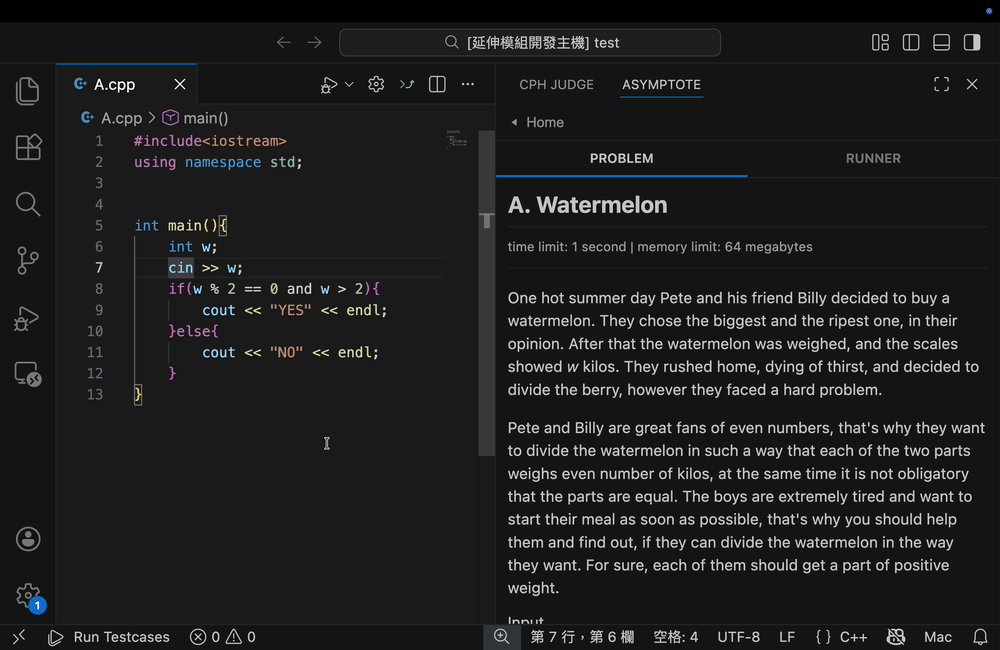
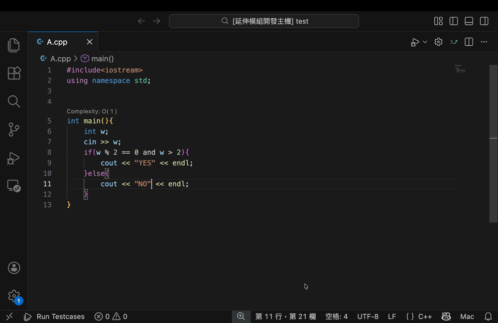

  
  <h1>Asymptote</h1>
  
<strong>Time Complexity Analysis & Companion for Competitive Programming</strong>

  
  
  

 

**Asymptote** is a VS Code extension designed to help competitive programmers visualize the theoretical speed of their code *while typing*. It combines a heuristic complexity analyzer with a robust local test runner.

> **⚠️ Note:** The complexity analysis is **heuristic** and based on static analysis patterns. It provides a "worst-case estimation" to help you catch $O(N^2)$ or $O(2^N)$ slips before submission, but it is not a formal mathematical proof.

---

## ✨ Features

### 1. Real-time Complexity Analysis (CodeLens)
See the Big O notation directly above your C++ functions. Asymptote parses your AST (Abstract Syntax Tree) to estimate time complexity.

* **Algebraic Awareness:** Understands that nested loops multiply ($N \times N = N^2$).
* **Confidence System:** Marks analysis with `(?)` if unknown functions are detected.
* **Toggleable:** Use `Asymptote: Toggle Complexity Lens` to show/hide the analysis instantly.

### 2. The Runner (Sidekick)
A dedicated sidebar for managing test cases without leaving your editor.

* **Problem Parsing:** One-click import from **Codeforces**. Fetches title, limits, and sample cases.
* **Local Execution:** Compiles and runs your code against inputs.
* **Verdict Display:** Clear **AC**, **WA**, **TLE**, or **RE** status with execution time.

---

## 📋 Requirements

To use the **Runner** feature (compiling and running C++ code), you must have a C++ compiler installed and accessible in your system's PATH.

* **GCC/G++**: Recommended (The extension currently uses `g++ -std=c++17`).

> *Note: The Complexity Analysis features work out-of-the-box without any external dependencies.*

---

## ⚙️ Extension Settings

You can toggle the complexity CodeLens via the Command Palette or Settings:

* `asymptote.enableCodeLens`: Enable/disable the complexity analysis CodeLens (default: `true`).

---

## 🧩 Supported Logic (Heuristics)

| Structure | Complexity Estimation |
| :--- | :--- |
| Simple Loops | $O(N)$ |
| Nested Loops | Multiplicative ($N \times M$) |
| Divide & Conquer (e.g., `k *= 2`) | $O(\log N)$ |
| `std::sort` | $O(N \log N)$ |
| `std::lower_bound` | $O(\log N)$ |
| Branching Recursion | $O(2^N)$ |

---

## 🚀 Release Notes

### 0.0.1
Initial release of Asymptote!
* Added Heuristic Complexity Analysis CodeLens.
* Added Secondary Sidebar Runner with Codeforces parsing.
* Integrated Tree-sitter for robust C++ parsing.

---

## 🤝 Contributing

This project is open source! If you want to add support for more algorithms or improve the detection logic:

1.  Fork the repository.
2.  Create your feature branch.
3.  Submit a Pull Request.

## 📄 License

Distributed under the MIT License. See `LICENSE` for more information.