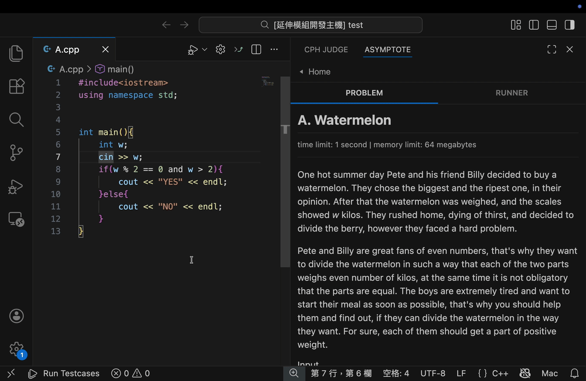
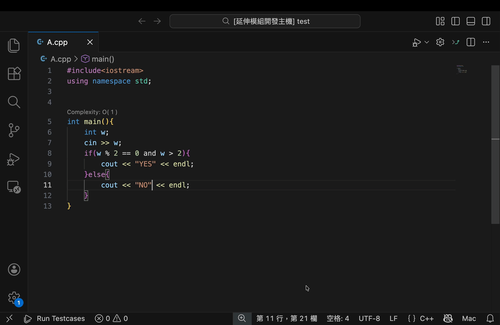

  
  <h1>Asymptote</h1>
  
<strong>Time Complexity Analysis & Companion for Competitive Programming</strong>

  
  
  
  

 

**Asymptote** is a VS Code extension designed to help competitive programmers visualize the theoretical speed of their code *while typing*. It combines a heuristic complexity analyzer with a robust local test runner. By providing a worst-case estimation instantly, it helps you catch accidental O(N²) or O(2^N) logic before you even compile.

> **Supported Language:** Asymptote currently supports **C++** exclusively.

---

## Quick Start

1. Install **Asymptote** from the VS Code Marketplace.
2. Open any `.cpp` file.
3. Start coding! The complexity CodeLens will automatically appear above your functions.
4. Use the sidebar to parse Codeforces problems and run local tests.

---

## Features

### 1. Real-time Complexity Analysis (CodeLens)
See the Big O notation directly above your C++ functions. Asymptote parses your AST (Abstract Syntax Tree) to estimate time complexity dynamically.

* **Algebraic Awareness:** Understands that nested loops multiply (e.g., N * M).
* **Confidence System:** Marks analysis with `(?)` if unknown functions or opaque external calls are detected.
* **Toggleable:** Use `Asymptote: Toggle Complexity Lens` to show/hide the analysis instantly.

### 2. Local Judge (Runner)
A dedicated sidebar for managing test cases without leaving your editor—acting as a lightweight Codeforces local judge built directly into VS Code.

* **Problem Parsing:** One-click import from **Codeforces**. Fetches title, limits, and sample cases.
* **Local Execution:** Compiles and runs your code against inputs.
* **Verdict Display:** Clear **AC**, **WA**, **TLE**, or **RE** status with execution time.
* **Strict Comparison Mode:** Option to enforce exact character-for-character matching for outputs, including trailing whitespaces.

### 3. Interactive Mode (Manual Judge)
Struggling with **Interactive Problems** (e.g., `? 1` -> `10`)? You no longer need to write a custom interactor.

* **Split-Column UI:** Left side is You (The Judge), Right side is Your Code.
* **Inline Input:** Type your response directly in the log flow, just like a terminal.
* **Automatic Piping:** Asymptote handles the complex process piping for you.

---

## Known Limitations

Asymptote's complexity analyzer uses static AST parsing and heuristics, which means it provides estimations, not formal mathematical proofs. 
* **Recursion & Master Theorem:** Complex recursive trees or divide-and-conquer algorithms might not be fully resolvable.
* **Dynamic Early Exits:** While it detects `break` and `return`, complex conditional early exits (like randomized algorithms) might overestimate the worst-case scenario.

---

## Requirements

To use the **Local Judge** feature, you need:

* **C++ Compiler (GCC/G++)**: Must be installed and accessible in your system's PATH.
* **Browser**: **Google Chrome, Microsoft Edge, or Brave**. Asymptote requires a local browser executable to silently scrape and parse problem limits and test cases from Codeforces securely. 

> *Note: The Complexity Analysis (CodeLens) works entirely offline and out-of-the-box without any external dependencies.*

---

## Extension Settings

You can customize Asymptote via the Command Palette or VS Code Settings:

* `asymptote.enableCodeLens`: Enable/disable the complexity analysis CodeLens (default: `true`).
* `asymptote.chromePath`: Custom path to your browser executable (optional, if auto-detection fails).
* `asymptote.strictComparison`: Require exact character match for test cases, including trailing spaces and newlines (default: `false`).

---

## Future Roadmap

* **Manual Tagging & Community Rules:** UI to manually correct and annotate complexity for `(?)` functions, establishing a solid foundational rule base before introducing AI.
* **Smart Cache (The Nexus):** Identify code structures via AST fingerprinting. Once a template is manually tagged, Asymptote remembers it globally.
* **Local LLM Integration:** After establishing the manual rule base, we plan to integrate local models to evaluate edge-case algorithms that fall outside static tree-sitter heuristics.

---

## Release Notes & Changelog

This project uses an automated CI/CD pipeline. All version history, release notes, and updates are automatically generated and maintained in the [CHANGELOG.md](CHANGELOG.md).

---

## Contributing

Contributions are welcome! Asymptote follows a modern, automated development workflow:

1. Fork the repository and create your feature branch (`git checkout -b feature/amazing-feature`).
2. Commit your changes following the **[Conventional Commits](https://www.conventionalcommits.org/en/v1.0.0/)** specification (e.g., `feat: add awesome feature`, `fix: resolve crash`). This is required for our automated release system.
3. Push to the branch (`git push origin feature/amazing-feature`).
4. Submit a Pull Request.

## License

Distributed under the MIT License. See `LICENSE` for more information.